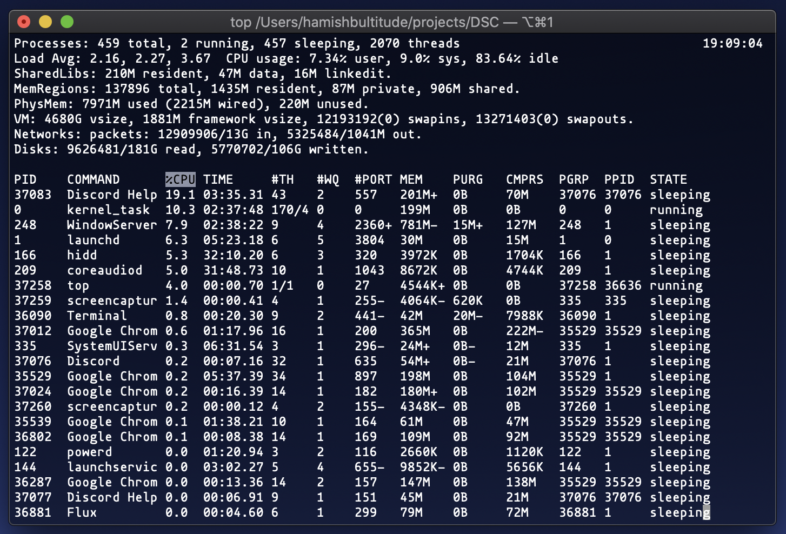
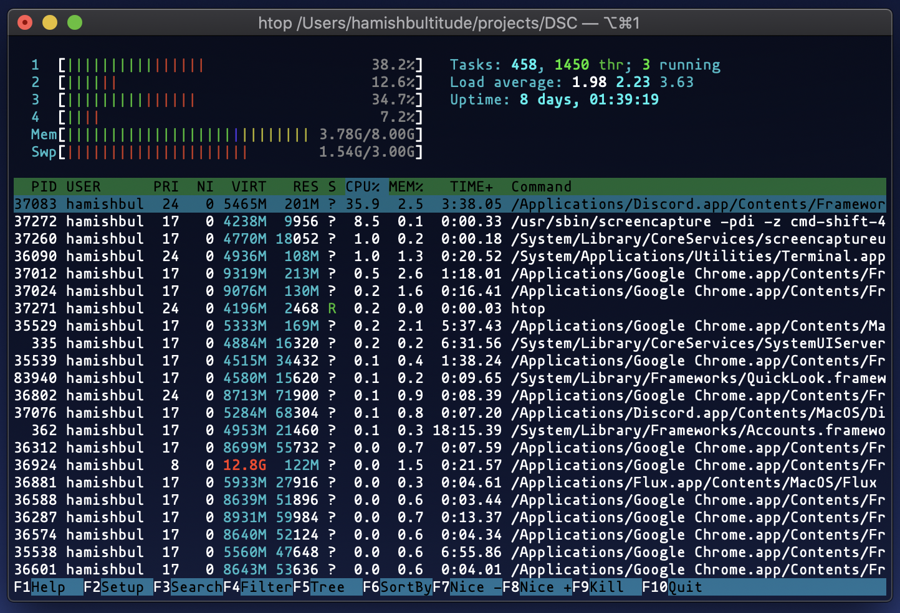
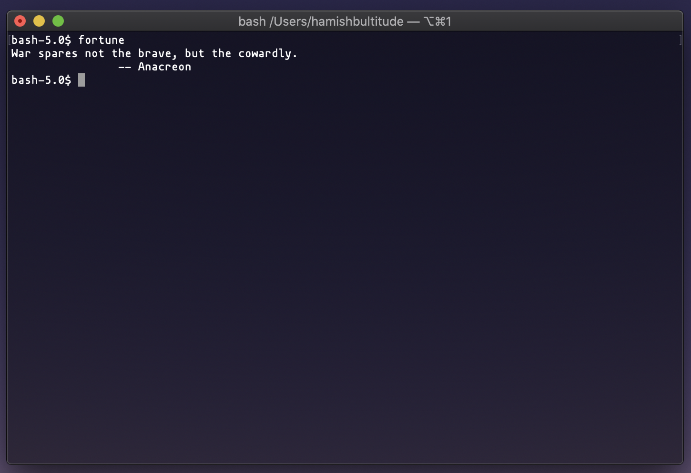
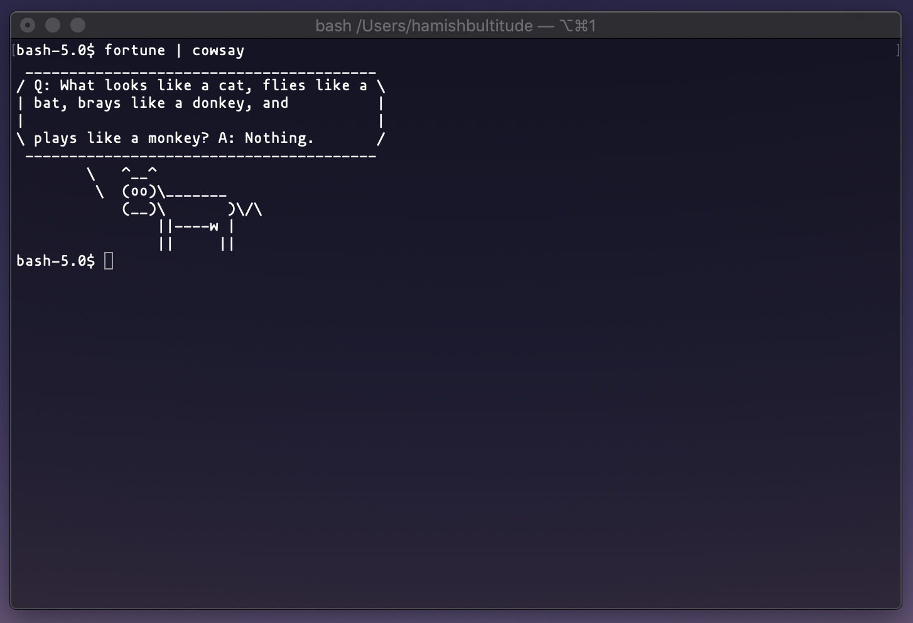
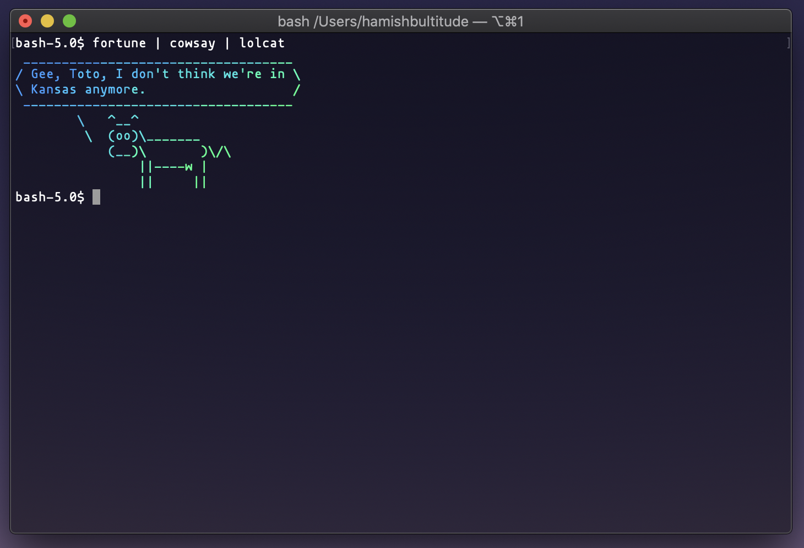
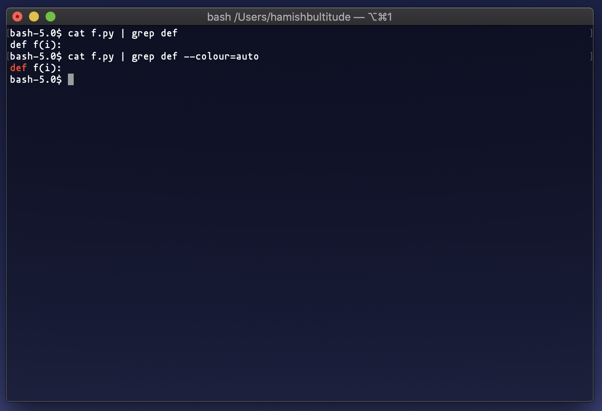

# 1:CLI - [YouTube Link](-)

## Questions?

Hit me up at @ham on UQCS's slack, https://slack.uqcs.org/
OR at h.bultitude@uq.net.au

## Introduction

Hello and welcome to the first lecture of the Google Developer Student Club initiative at UQ. My name is Hamish Bultitude and today we'll be walking through an introduction to the UNIX command line together. This talk is intended for students that are in first and second year (before taking CSSE2310), but it can also act as refresher if you happen to be looking for one!

Note that this walkthrough is strictly for the UNIX command line interface (or CLI for short) and whilst there is *some* shared functionality with [Windows systems](check), this lecture is primarily applicable to Linux, macOS, and Windows Subsystem for Linux (WSL) systems. Check online for info on how to install WSL if you are on Windows, or you may be able log in to UQ's student server - *MOSS* via SSH (moss.labs.eait.uq.edu.au).

Lets begin!

## General Terminal

In order to understand why the command line is so valuable you have to understand the importance of feedback loops to the workflow of the average developer. Prior to using the command line, you've probably become used to running code from an IDE by the press of a button, or by moving around the filesystem by clicking through finder or Windows explorer. But by using the command line, it becomes easier to get tasks done faster & with greater clarity. With a command line interface the time taken to run code and modify the filesystem can be drastically reduced and certain tasks you might have had to do by hand can be partially or fully automated using combinations of useful tools.

/Terminal History/

/Bash/

## Opening the terminal

The terminal should be pretty easy to find on all operating systems. 

`Terminal` <!-- macOS & many Linux distros

`Command Line` or `cmd.exe` - Windows

-->Again, this is for UNIX systems, so the use of the command line program on Windows will not be supported here. If you have installed WSL on windows, it should be fairly easily to open a new CLI. Check online for more information.

Upon running the Terminal program, you should be see a window similar to this (don't worry if it's a different colour on macOS):


Congrats! *The hardest step to learning something is actually beginning*.

## Moving around the filesystem

So what now? Well, most likely (if you haven't fooled around with the CLI before) bash has started you off in your home directory. But what exactly is that? The home directory is 'your' space on the filesystem, for example, at UQ this is `/home/students/s1234567`, where you are free to edit files as you please. You can see whatever folder you are at currently using the `pwd` command - standing for *print working directory*.

#### Creating Files

We can create files at this folder by using the `touch <filename>` command. This will create an empty file within our home directory, as that is the current folder that we are in!

#### Creating Directories (Folders)

We may want to create a new folder so we can better organise our files! This can be done with the `mkdir <name>` command. In case you were wondering, `mkdir` stands for *make directory*.

#### Changing Directories 

What use is a folder if we cannot access it though? Enter the `cd <folder>` command, standing for *change directory*. Make sure to supply the full path of the directory that you want to access, or just the folder name if that folder is within the directory you are in! Confused? Have a play around with it :^)

So we are able to enter folders, how do we back out of them? In every folder there are two 'special' folders - `.` representing the current folder (a concept we will review later) and `..` representing the parent directory. Therefore, if we wish to move to folder previous to the current, we can use `cd ..`.

We may want to 'free' ourselves from our home directory and step to the root of the filesystem. This can be done with `cd /` to move to the `/` folder, aka the root of the filesystem.

Whoops! Lets say we got lost and want to get back to the home directory - Just use `cd` to quickly move back to your home directory. This is shorthand for `cd ~`, as `~` is a link to your home directory.

Before moving on, have a quick practice of moving around your filesystem.

## What's in this folder: 1

After creating files and folders for a while, it becomes hard to remember exactly what is in a folder! Use `ls` to return whatever is in your current folder, or `ls <folder>` to see what is in the supplied folder.

#### Flags: All this power and more

Flags are an important part of UNIX commands. The use of flags allows for extended functionality of certain commands. Some examples are seen below:

`ls -a`; lists ALL the files in the directory (including *hidden* files with the `.` extension (a la `.git/`). These files wouldn't be included with the normal `ls` command.

```sh
 ./              .DS_Store       1-CLI.md        3-AppEngine.md  README.md
 ../             .git/           2-GO.md         DSCLogo.png     images/
```

---

`ls -l`; lists regular files in a *detailed* view format.

```sh
total 120
-rw-r--r--@ 1 hamishbultitude  staff   5549 18 Jul 20:07 1-CLI.md
-rw-r--r--@ 1 hamishbultitude  staff     24 15 Jul 17:59 2-GO.md
-rw-r--r--@ 1 hamishbultitude  staff     24 15 Jul 17:59 3-AppEngine.md
-rw-r--r--@ 1 hamishbultitude  staff  37470 15 Jul 18:04 DSCLogo.png
-rw-r--r--@ 1 hamishbultitude  staff    229 15 Jul 19:14 README.md
drwxr-xr-x  4 hamishbultitude  staff    128 15 Jul 19:29 images/
```
---

We can of course combine flags to specify further functions. See below:

`ls -a -l` or just simply `ls -al`

```sh
total 136
drwxr-xr-x  10 hamishbultitude  staff    320 18 Jul 20:14 ./
drwxr-xr-x@ 46 hamishbultitude  staff   1472 17 Jul 22:22 ../
-rw-r--r--@  1 hamishbultitude  staff   6148 15 Jul 19:29 .DS_Store
drwxr-xr-x  12 hamishbultitude  staff    384 18 Jul 20:08 .git/
-rw-r--r--@  1 hamishbultitude  staff   6685 18 Jul 20:14 1-CLI.md
-rw-r--r--@  1 hamishbultitude  staff     24 15 Jul 17:59 2-GO.md
-rw-r--r--@  1 hamishbultitude  staff     24 15 Jul 17:59 3-AppEngine.md
-rw-r--r--@  1 hamishbultitude  staff  37470 15 Jul 18:04 DSCLogo.png
-rw-r--r--@  1 hamishbultitude  staff    229 15 Jul 19:14 README.md
drwxr-xr-x   4 hamishbultitude  staff    128 15 Jul 19:29 images/
```

---

## Manual

If you ever get confused on how a command works, `man <command>` is your friend! For example, say we forget what the function of `ls` was? We could find out quickly with `man ls`. Most UNIX commands have an associated manual entry, yet let it be noted that some may not. At that point, dare I say, Google is your friend.

There are a variety of numbers associated with `man`. These come into play when there are multple version of the same command - say `printf` is both a User Command and a C function.

1. User Commands
2. System Calls
3. C Library Functions
4. Devices and Special Files
5. File Formats and Conventions
6. Games et. Al.
7. Miscellanea
8. System Administration tools and Daemons

To separate out these, use `man <num> command` to be specific on the category of the command.

`man` also contains information on the flags for each command that extend its functionality!

Understanding `man` is an invaluable skill and `man thingyoucantmakework` should be your first stop before heading over to StackOverflow. 

## Manipulating Files

#### Moving and Copying Files
`cp` stands for *copy*, and believe it or not, allows you to copy files! Syntax is `cp <orig-file> <new-file>`. If you want to copy an entire directory, you'll have to make use of `cp`'s `-r` flag.

`mv` stands for *move*, and has two functions, firstly moving a file from one place to another (think traditional cut and paste). Similar syntax to `cp`, with `mv <orig-location> <new-location>`. Its other use allows us to rename files in place: `mv <oldname> <newname>`.  

#### Reading Files
`cat` stands for *concatenate*, and has some interesting functions. When supplying two files (`cat file1 file2`), `cat` will output both of the contents of these files sequentially! What people use `cat` for mostly is just checking the contents of a single file (`cat file1`) instead of opening the file in a text editor.

`less` is a similar command to `cat` which allows you to step through longer files in specified pages (height of the termi

#### Deleting Files
Finally, `rm` stands for *remove*, and acts to delete specified files. Just supply the file names / directories of what you want to delete.
Moreover, there are some important `rm` flags. Firstly, `-r` stands for *recursion*, and selects files in subdirectories for deletion. Secondly, `-f` stands for *force*, and works to remove files without asking for further confirmation from the user.

Judging by the previous section, you can probably tell that `rm -rf` is a dangerous command. See `rm -rf /` for added nightmares (deletes the entire root directory!)

## Text Matching & Wildcards

After a while of using commands, it can get frustrating to constantly type out file names, especially if you want to apply a command *en masse*. In comes pattern matching!


For example,

​```
$ ls *.jpg
a.jpg

$ ls ?.pdf
d.pdf

$ ls [ab]*
a.jpg  b.gif

$ ls *at*
cat.png bat.png attic.jpg

## The `alias` commmand

`alias` is a wonderful command that can help streamline your workflow. You may get sick of supplying the same command with the same flags over and over, and want your own shortform way of writing them out. Syntax is `alias <new-cmd>="<longcmd>"`. Here are some important ones that I personally use below...

```bash
# ls commands
alias ll="ls -l"
alias la="ls -al"

# git commands (covered later in the lecture)
alias gc="git commit"
alias gco="git checkout"
alias gp="git push"
alias gb="git branch"

# general
alias ..="cd .."
alias py3="python3"
alias grep='grep --colour=auto
```

\*Note that these aliases only live as long as your current terminal session. There are ways to make them persist, but we'll cover later.

/Request for more/

If you ever get sick of an alias, you can use `unalias <alias-name>` to remove that alias'd command.

## Vim vs Nano vs Emacs: The Eternal Battle

So now we know how to see files and create them, but what about editing them? We can use text editors for this! You can pick your poison, but common options include `vim`, `nano` and `emacs`. Each have their advantages and drawbacks, so try each one out to see what you enjoy! Personally I use `vim`. If you'd like to see a walkthrough of vim's basic functionality have a look at MIT's [*missing semester*](https://www.youtube.com/watch?v=a6Q8Na575qc) lecture on vim. Let's see a quick demo for creating a Python script...

Quick notes on vim commands / modes - I won't cover them in depth as this isn't a vim lecture, but be sure to check out MIT's lecture on it linked above if you want to know more!

> Modes: Entering `vim` is normal mode, use `h j k l` or the arrow keys to move the cursor around. Press `i` to enter insert mode, where you can enter text! To leave insert mode, just hit `esc`.

> Commands can only be entered in normal mode. Particularly handy commands include: `:w` to save, `:q` to quit, `:wq` to save and quit.

Try writing the following in `vim dsc.py` and returning to the command line after saving.

```python
def hello():
	print("Hello, DSC!")
	
	
if __name__ == "__main__":
	hello()
```

## Running programs

Alright, now we have a file that can act as a program! How do we run this though?

For python (an interpreted language (kinda)), we can just run the file by supplying files via the `python3 <file> <arguments>` command.

For other languages (C, Java, etc), we have to compile the code into an executable format. `gcc` is a compiler for the C programming language which, by default, produces an executable `a.out` file. To actually *run* the file, we call the file via `./a.out`, where `./` effectively means to execute `a.out` in the current folder.

To change the name of the executable, we an use `gcc <file> -o <output-name>`.

## Ending programs

When writing programs, you may find that you eventually run into a situation where you just want to end the program right away. `ctrl + C` will send an `interrupt` signal to the program, and if otherwise not handled by your program (using signal handlers), will often just exit the program.

`ctrl + D` is a similar command, signifying `EOF - end of file` - that there is no more input for the program to read!

If you let the program run its course (a la it hasn't become stuck in an infinite loop), the program will eventually return input to the command line.

## Whats going on?

So far we have pretty good knowledge of commands exploring the filesystem - yet it can be super useful to see what is currently running on the machine.

There are two common commands that allow you to see what is occurring on the machine at any given time. Take note of the columns `pid, command, %CPU`.
`top` - A simple view



`htop` - A 'higher quality' top, with supported actions on each process, and nice graphs for CPU usage.



Oh no! Discord is taking up 35.9% of my CPU which personally, I'm not comfortable with! Time to `kill` it, literally.
`kill` - From `man`: The kill utility sends a signal to the processes specified by the pid operands. Lucky we noted the `pid` of the process from `htop` or `top`! `kill` is used for sending signals to processes - so let's see exactly what signals we can send with `kill -l`

```sh
 1) SIGHUP	 2) SIGINT	 3) SIGQUIT	 4) SIGILL	 5) SIGTRAP
 6) SIGABRT	 7) SIGEMT	 8) SIGFPE	 9) SIGKILL	10) SIGBUS
11) SIGSEGV	12) SIGSYS	13) SIGPIPE	14) SIGALRM	15) SIGTERM
16) SIGURG	17) SIGSTOP	18) SIGTSTP	19) SIGCONT	20) SIGCHLD
21) SIGTTIN	22) SIGTTOU	23) SIGIO	24) SIGXCPU	25) SIGXFSZ
26) SIGVTALRM	27) SIGPROF	28) SIGWINCH	29) SIGINFO	30) SIGUSR1
31) SIGUSR2
```

There are a few that are important for ending processes here - `SIGINT` (which is what ctrl + C sends!), and `SIGQUIT`.
> You can look at SIGINT as "user-initiated happy termination" and SIGQUIT as "user-initiated unhappy termination."

There are some more 'quitting' signals, notably `SIGKILL` which kills the process *immediately*, without allowing the program any chance to cleanup - **only use this as a last result!**

## `sudo`

`sudo` is an interesting command - it allows for users to execute commands with higher level permissions - named *superuser*. You'll find sometimes when executing commands that they will fail... sometimes these commands will require `sudo` permissions in order to run (e.g. installing packages with `apt` on Ubuntu).

## IO (>)

Have you ever to save the output of certain commands to a file so that we can inspect them later! Or have you ever wanted to automate the input to a program? Here we can use IO (input/output) redirection to achieve this!

### Saving output to a file
Here is a brief example using python...

`script.py`:

```python
for i in range(0, 5):
    print(i)
```

Now, using the terminal...

```sh
$ python3 script.py > save.log
$
```

... you can see there is no output! This is because its being redirected to the file `save.log`. Now, if we were to `cat save.log`...

```sh
$ cat save.log
0
1
2
3
4
```

### Sending input to a process

We can perform the same function, but in reverse! See the following python script `input.py` that is reads input from the user and prints it out...

```python
recv = input()
print(recv)
```

... and now for the actual input file, `in.txt` ...

```txt
Hello, stdin!
```

... and now to send it to the python script! (we have to get the contents of the file with the `cat` command).

```sh
$ cat in.txt > python3 input.py
  Hello, stdin!
```

If you are interested on this topic, have a look at `>>` redirection which allows for appending new input to a file or `2>` redirection errors in the program `stderr` to be sent to a file.

## Pipes ( | )

Pipes are similar to IO redirection, except instead of redirecting IO of process into files, we can redirect IO between processes to combine functions together! This allows for complex behaviour from 'simple' commands joined together! *This is an underlying principle of UNIX*: small tools, each designed to do one thing well, that can be combined to accomplish more complex tasks. Here, we will use three commands that do not come installed by default, but make for some fun examples :)

`man fortune` - print a random, hopefully interesting, fortune!

`man cowsay` - configurable speaking cow (just try it and you'll see!)

`man lolcat` - rainbow coloring effect for text console display

Let's build up some functionality... `fortune` by itself produces...



Now, when we call `fortune | cowsay` we are inputting the fortunes output into the cowsay command by using the `|` symbol, representing a pipe between both commands.



... and we get some interesting output! Finally, let's get all three commands together now ...



... that's it! We have a colourful talking cow! So, to reiterate, we have taken the output from `fortune`, sent it through `cowsay` and colourised the text with `lolcat`. This is only a fun example of what pipes can do, yet there are more useful examples in the following example! `grep`!

## `grep`

`grep` is a pattern matching command, used to search text supplied to it either through pipes or as a command line argument. When finding a match, grep returns the entire line. Before explaining how the command works, its important to describe an `alias` that we have established before. By using `alias grep='grep --colour=auto`, we get colourised output, making it easier to see exactly what `grep` matched with! See 'def' is marked in red in the second example below...



We want to search for certain words from the file `text` below...

```txt
cat dog bird pig
monster human bear
horse samurai being
```

Let's see two examples of its usage...

The file `text` as a command line argument...

```bash
$ grep text dog
cat dog bird big
```

... and now piping the input of `cat text` to grep

```bash
$ cat text | grep dog
cat dog bird pig
```

Of course, we can use UNIX pattern matching here. Lets see an example where we only want to find lines with words starting with 'be'...

```bash
$ cat text | grep be*
monster human bear
horse samurai being
```

## Connecting to other computers (`ssh`, `scp`)

Alright! Now for a command I promise you will use often. `ssh`, or *secure shell*, is a method of remotely logging into computers. In this case, I want to be able to log into `moss`, UQ's student access computer, so that I can work on my C programming assignment! There are a few aspects to this command:

`ssh user@address`

or for moss... `ssh s1234567@moss.labs.eait.uq.edu.au`

If the server requires a password, you will be asked to type it. However, this can get very tiring over time. One alternative is to use SSH keys to log on (see `ssh-keygen` and [TheGeekDiary's](https://www.thegeekdiary.com/using-the-ssh-keygen-command-in-linux/) tutorial on the topic).

So, we've gone and created a file that we want to copy from the remote computer to our local machine. We can use `scp`, or *secure copy* to move files between the machines, using the following formats:

***To copy the file "foobar.txt" from a remote host to the local host***

```sh
$ scp user@host:foobar.txt /path/to/directory
```

***To copy the file "foobar.txt" from the local host to a remote host***

```sh
$ scp foobar.txt user@host:/path/to/directory
```

That should be enough information to get you working on remote hosts efficiently! I also recommend using `remote deploy` options on IDEs such as VSCode or any JetBrains flavour to prevent repeatedly using `scp` to copy assignment files - I have seen many people lose precious work to this!

## Version control (Git)

Naturally, with programming comes the need to save work. Here we will briefly touch on how to keep track of work with `git`, a form of version control.

### Beginning with `init`

To start recording work for a certain directory, we run `git init`.

### Branching!

Before moving further, we must address the concept of branches. Firstly, there is `master`, where the best and most functional code that you are working on should reside. Next, you should create your own branches representing a feature to be working on with the command `git branch <branch name>`, and switch to working on that branch with `git checkout <branch name>`.

### Staging files

Once we have created / edited some files within this folder, first we must `git add <files>` to be staged for recording, where `git add .` adds the entire directory. 

### Commiting files

Now, we can *commit*, where we take a snapshot of the code at the current point in time. This can be run with `git commit` which will open a text editor for you to add a meaningful message about the contents of the changes to your code. To circumvent the use of a text editor, we can use `git commit -m "commit msg"` where you can quickly add in quotation marks the message.

### Pushing files

Finally, we have the option of storing our code in an online repository. This is where solutions like GitHub come into play. We can make a repo online through GitHub, and add this to our local `git` instance with `git remote add origin <GitHub Link>`. Finally, we can move our code to this online repo with `git push -u origin <branch name>`, and afterwards just using `git push`.

## Alternatives to Bash

There are also alternative shells available for Linux and macOS. While bash is an incredible system, other services such as `zsh` and `fish` can extend the function of your shell and allow for greater levels of customisation, which, let's face it, is a big draw for a lot of programmers. Do some further investigations into which shells may fit you best!

## Final thoughts

Thanks for listening through this lecture! Whilst using the CLI may be frightening, just remember the widespread applications and efficient workflows that the CLI can give you! Hope you found this lecture helpful, and please reach out to me if you have any questions at all!
