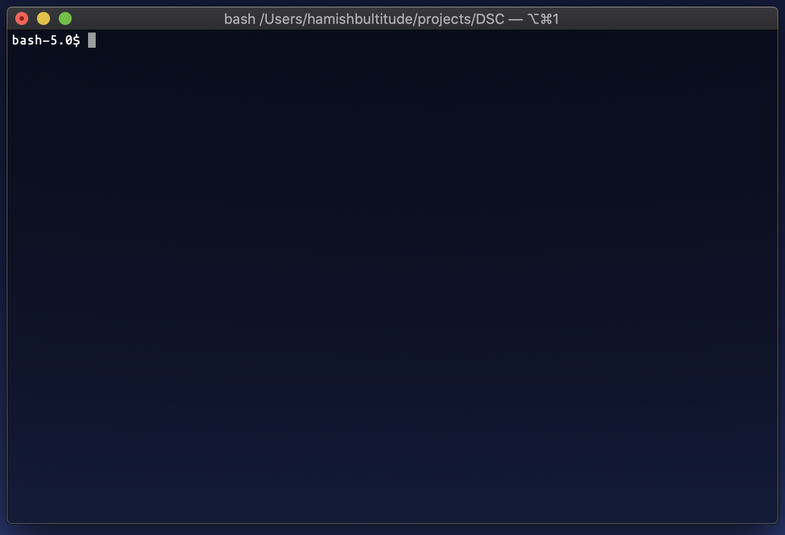
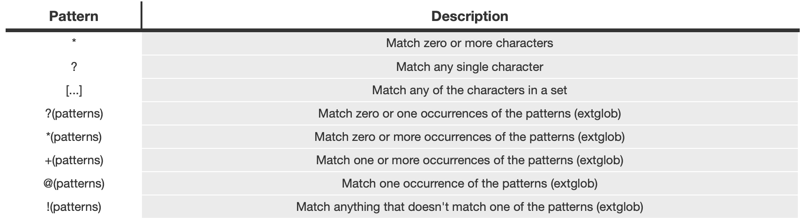

# 1:CLI - [YouTube Link](-)

### Questions?
Hit me up at @ham on UQ's slack, https://slack.uqcs.org/
OR at h.bultitude@uq.net.au

## Introduction

Hello and welcome to the first lecture of UQ's partnership with Google - the  Developer Student Club initiative. My name is Hamish Bultitude, and today we will be going through the UNIX command line together. This lecture is intended for students that are in first and second year before taking CSSE2310, yet can act as a refresher if you are looking for it!

Note that this is indeed for the UNIX commandline (or CLI for short) - whilst there is *some* crossover with [windows systems](check), applicability of this lecture includes Linux, macOS and Windows Subsystem for Linux (WSL). Check online for info on how to install WSL if you are on windows, or you can login to UQs student computer - *MOSS* via SSH. 

Lets begin!

## General Terminal
Firstly, it is important to address why CLI is important. Previous to using the command line, you are probably used to running code from an IDE by the press of a button, or by moving around the filesystem by clicking through finder or windows explorer. Yet, by using the command line, it becomes easier to get tasks done faster & with greater clarity.

<Terminal History>

<Bash>

## Opening the terminal
The terminal should be pretty easy to find on all operating systems. 

`Terminal` - macOS & many Linux distros

`Command Line` or `cmd.exe` - Windows

Again, this is for UNIX systems, so the use of the command line program on windows will not be supported here. If you have installed WSL on windows, it should be fairly easily to open a new CLI. Check online for more information.

Either way, you should be dumped to a screen that looks similar to this...


Congrats! *The hardest step to learning something is actually beginning*. 

## Moving around the filesystem
So without any prompts, what do we do now? Well, most likely (if you haven't fooled around with the CLI before) Bash has thrown you to your home directory. But what exactly is that? The home directory is 'your' space on the filesystem, for example, at UQ this is `/home/students/s1234567`, where you are free to edit files as you please. You can see whatever folder you are at currently using the `pwd` command - standing for *print working directory*.

We can create files at this folder by using the `touch <filename>` command. This will create a file within our home directory, as that is the current folder that we are in! 

We may want to create a new folder so we can better organise our files! This can be done with the `mkdir <name>` command. In case you were wondering, `mkdir` stands for *make directory*. 

What use is a folder if we cannot access it though? Enter the `cd <folder>` command, standing for *change directory*. Make sure to supply the full path of the directory that you want to access, or just the folder name if that folder is within the directory you are in! Confused? Have a play around with it :^)

So we are able to enter folders, how do we back out of them? In every folder there are two 'special' folders - `.` representing the current folder (a concept we will review later) and `..` representing the parent directory. Therefore, if we wish to move to folder previous to the current, we can use `cd ..`.

We may want to 'free' ourselves from our home directory and step to the root of the filesystem. This can be done with `cd /` to move to `/` folder, aka the root of the filesystem. 

Whoops! Lets say we got lost and want to get back to the home directory - Just use `cd` to quickly move back to your home directory.

Before moving on, have a quick practice of moving around your filesystem. 

## Manual
If you ever get confused on how a command works, `man <command>` is your friend! For example, say we forget what the function of `ls` was? We could find out quickly with `man ls`. Most UNIX commands have an associated manual entry, yet let it be noted that some may not. At that point, dare I say, Google is your friend. 

There are a variety of numbers associated with `man`. These come into play when there are multple version of the same command - say `printf` is both a User Command and a C function.

1. User Commands
2. System Calls
3. C Library Functions
4. Devices and Special Files
5. File Formats and Conventions
6. Games et. Al.
7. Miscellanea
8. System Administration tools and Deamons

To separate out these, use `man <num> command` to be specific on the category of the command.

Whilst Google is pretty awesome, make sure you can understand the layouts and workings of the `man` command, probability says you are going to need it at least some point down the line.  

## What's in this folder: 1
After creating files and folders for a while, it becomes hard to remember exactly what is in a folder! Use `ls` to return whatever is in your current folder, or `ls <folder>` to see what is in the supplied folder.

## Flags: What's in this folder: 2
Flags are an important part of UNIX commands. The use of flags allows for extended functionality of certain commands. Some examples are seen below:

`ls -a`; lists ALL the files in the directory (including *hidden* files with the `.` extension (a la `.git/`). These files wouldn't be included with the normal `ls` command.
> ```
./              .DS_Store       1-CLI.md        3-AppEngine.md  README.md
../             .git/           2-GO.md         DSCLogo.png     images/
``` 
---

`ls -l`; lists regular files in a *detailed* view format. 
> ```
total 120
-rw-r--r--@ 1 hamishbultitude  staff   5549 18 Jul 20:07 1-CLI.md
-rw-r--r--@ 1 hamishbultitude  staff     24 15 Jul 17:59 2-GO.md
-rw-r--r--@ 1 hamishbultitude  staff     24 15 Jul 17:59 3-AppEngine.md
-rw-r--r--@ 1 hamishbultitude  staff  37470 15 Jul 18:04 DSCLogo.png
-rw-r--r--@ 1 hamishbultitude  staff    229 15 Jul 19:14 README.md
drwxr-xr-x  4 hamishbultitude  staff    128 15 Jul 19:29 images/
```
---

We can of course combine flags to specify further functions. See below:

`ls -a -l` or just simply `ls -al`
> ```
total 136
drwxr-xr-x  10 hamishbultitude  staff    320 18 Jul 20:14 ./
drwxr-xr-x@ 46 hamishbultitude  staff   1472 17 Jul 22:22 ../
-rw-r--r--@  1 hamishbultitude  staff   6148 15 Jul 19:29 .DS_Store
drwxr-xr-x  12 hamishbultitude  staff    384 18 Jul 20:08 .git/
-rw-r--r--@  1 hamishbultitude  staff   6685 18 Jul 20:14 1-CLI.md
-rw-r--r--@  1 hamishbultitude  staff     24 15 Jul 17:59 2-GO.md
-rw-r--r--@  1 hamishbultitude  staff     24 15 Jul 17:59 3-AppEngine.md
-rw-r--r--@  1 hamishbultitude  staff  37470 15 Jul 18:04 DSCLogo.png
-rw-r--r--@  1 hamishbultitude  staff    229 15 Jul 19:14 README.md
drwxr-xr-x   4 hamishbultitude  staff    128 15 Jul 19:29 images/
```
---

Make sure to check `man` for further info on flags for your favourite commands!

## Files
`cp` stands for *copy*, and believe it or not, allows you to copy files! Syntax is `cp <orig-file> <new-file>`.

`mv` stands for *move*, and has two functions, firstly moving a file from one place to another (think traditional cut and paste). Similar syntax to `cp`, with `mv <orig-location> <new-location>`. 

As a result, we can also use `mv` to rename files in place.  

`cat` stands for *concatenate*, and has some interesting functions. When supplying two files (`cat file1 file2`), `cat` will output both of the contents of these files sequentially! What people use `cat` for mostly is just checking the contents of a single file (`cat file1`) instead of opening the file in a text editor. 

`less` is a similar command to `cat` which allows you to step through longer files in specified pages (height of the terminal window) with `space` for moving forward and `b` for moving backwards.

Finally, `rm` stands for *remove*, and acts to delete specified files. Just supply the file names / directories of what you want to delete.
Moreover, there are some important `rm` flags. Firstly, `-r` stands for *recursion*, and selects files in subdirectories for deletion. Secondly, `-f` stands for *force*, and works to remove files without asking for further confirmation from the user.

Judging by the previous section, you can probably tell that `rm -rf` is a dangerous command. See `rm -rf /` for added nightmares (deletes the entire root directory!)

## Text Matching & Wildcards
After a while of using commands, it can get frustrating to constantly type out file names, especially if you want to apply a command en mass. In comes pattern matching!


For example,
 
```sh
$ ls *.jpg
a.jpg

$ ls ?.pdf
d.pdf

$ ls [ab]*
a.jpg  b.gif

$ ls *at*
cat.png bat.png attic.jpg
```
## The `alias` commmand 
`alias` is a wonderful command that can help streamline your workflow. You may get sick of supplying the same command with the same flags over and over, and want your own shortform way of writing them out. Syntax is `alias <new-cmd>="<longcmd>"`. Here are some important ones that I personally use below...

```
# ls commands
alias ll="ls -l"
alias la="ls -al"

# git commands (covered later in the lecture)
alias gc="git commit"
alias gco="git checkout"
alias gp="git push"
alias gb="git branch"

# movement in the filesystem
alias ..="cd .."

```
<<<<REQUEST FOR MORE>>>>

If you ever get sick of an alias, you can use `unalias <alias-name>` to remove that alias'd command. 

## Vim vs Nano vs Emacs: The Eternal Battle
So now, we know how to see files and create them, but what about editing them? We can use text editors for this! Here, you can pick your poison: I pose three options here, `vim`, `nano` and `emacs`. Each have their advantages and drawbacks, so try each one out to see what you enjoy! Personally I use `vim`, and use many of the extensions that MIT's [*missing semester*](https://www.youtube.com/watch?v=a6Q8Na575qc) lectures entail. Let's see a quick demo for creating a python script...

Quick notes on vim commands / modes - I won't cover them in depth as this isn't a vim lecture, but be sure to check out MIT's lecture on it linked above if you want to know more!

> Modes: Entering `vim` is normal mode, use `h j k l` or the arrow keys to move the cursor around. Press `i` to enter insert mode, where you can enter text! To leave insert mode, just hit `esc`.

> Commands: `:w` to save, `:q` to quit, `:wq` to save and quit.

Try writing the following in `vim dsc.py` and returning to the command line after saving.

```python
def hello():
	print("Hello, DSC!")
	
	
if __name__ == "__main__":
	hello()
```

## Running programs
Alright, now we have a file that can act as a program! How do we run this though?

For python (an interpreted language (kinda)), we can just run the file by supplying files via the `python3 <file> <arguments>` command.

For other languages (C, Java, etc), we have to compile the code into an executeable format. `gcc` is a compiler for the C programming language which, by default, produces an executable `a.out` file. To actually *RUN* the file, we call the file via `./a.out`, where `./` effectively means to execute `a.out` in the current folder. 

To change the name of the executable, we an use `gcc <file> -o <output-name>`. 

## Ending programs
When writing programs, you may find that you eventually run into a situation where you just want to end the program right away. `ctrl + C` will send an `interrupt` signal to the program, and if otherwise not handled by your program (using signal handlers), will often just exit the program. 

`ctrl + D` is a similar command, signifying `EOF - end of file` - that there is no more input for the program to read!

If you let the program run its course (a la it hasn't become stuck in an infinite loop), the program will eventually return input to the command line. 

## Whats going on?
So far we have pretty good knowledge of commands exploring the filesystem - yet it can be super useful to see what is currently running on the machine. 

`top` - 

`htop` - 

`kill` -  

## `sudo`

## IO (> and >>) 

## Pipes ( | ) 

## Grep

## Connecting to other computers (SSH)

## Version control (Git)

## Installing More Programs

## Esoteric Additions
-fish 

## Final thoughts
Thanks for listening through this lecture! Whilst using the CLI may be frightening, just 
